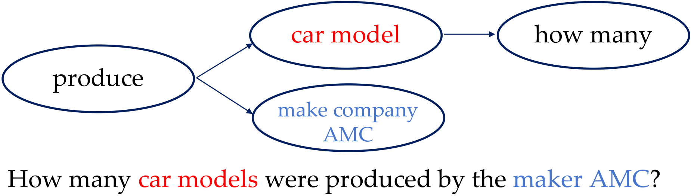
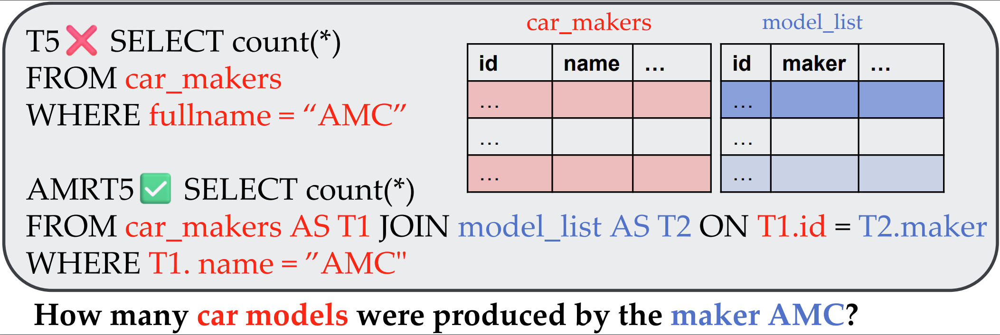

# AMRT5

This repository contains the official implementation of experiments conducted in
- On Enhancing NL2SQL Semantics \[Scalable Data Science\] (VLDB 2024 Submission)

🌲 Repo structure:
- `configs`: Json files for various running configurtions
- `seq2seq`: Codebase for **NL2SQL** experiments, which is adapted from [Picard](https://github.com/ServiceNow/picard) for the file structure.
  - `datasets`: Dataset related python files
  - `metrics`: Metrics related python files
  - `utils`: Folder with python utility files
- `T5`: A modified T5 architecture with AMR augmented, which is derived from [Huggingface Transformers](https://github.com/huggingface/transformers).
- `run_seq2seq_internal.py`: A python file for training main experiments.

### Dependencies
 - python3.7 or above
 - pytorch 1.10 or above
 - transformers
 - datasets

### Basic Usage

```bash
python run_seq2seq_internal.py
```

### NL2SQL datasets
The Spider dataset is publically available from [here](https://drive.usercontent.google.com/download?id=1iRDVHLr4mX2wQKSgA9J8Pire73Jahh0m&export=download&authuser=0).

SYN, DK and REALISTIC are from [here](https://github.com/ygan/Spider-Syn), [here](https://github.com/ygan/Spider-DK) and [here](https://zenodo.org/records/5205322).

## Main Result
We report the main result on Spider datasets.

| Approach         | Exact Match Acc | Execution Acc |
|------------------|-----------------|---------------|
| T5-large         | 67.0            | 69.3          |
| AMRT5-large (LN) | 71.5            | 73.9          |
| AMRT5-large (SC) | **72.0**            | **74.7**          |
|------------------|-----------------|---------------|
| T5-3B | 71.9            | 75.0          |
| AMRT5-3B (SC) | **75.0**            | **77.9**          |

## AMR

 

AMR is a comprehensive semantic graph representation of a sentence. It utilizes a directed acyclic graph structure with a root node and represents important concepts as nodes and semantic relationships as edges.

 

AMR can help PLM to augment their semantics to strive a better trade off between efficiency and effectiveness.

### AMR parser

The parser we choose is orginal from [here](https://github.com/goodbai-nlp/AMRBART). We modified this to be suitable for Natural Language Questions (NLQs) by retraining it using [a corpus of NLQ-AMR pairs](https://github.com/IBM/AMR-annotations).

## License

MIT
